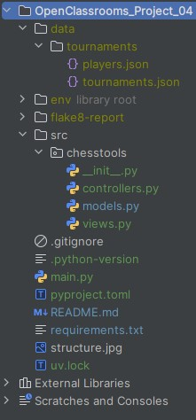

# OpenClassrooms_Project_04
**Project 04 : develop a Python application**

## DESCRIPTION

This project was completed as part of the "Python Developer" path at OpenClassrooms.

The goal was to develop a Python offline application capable of:
- Creating and managing a chess tournament and its players for a chess club
- Saving datas in json files
- Displaying / exporting several reports based on tournaments and players

## PROJECT STRUCTURE

  

## INSTALLATION

**- Clone the repository :**  
`git clone https://github.com/Tit-Co/OpenClassrooms_Project_04.git`

**- Navigate into the project directory :**  
`cd OpenClassrooms_Project_04`

**- Create a virtual environment and dependencies :**  
### Option 1 - with [uv](https://docs.astral.sh/uv/)
`uv` is an environment and dependencies manager.

**- Install environment and dependencies**

`uv sync`  

### Option 2 - with pip
**- Install the virtual env :** 
`python -m venv env`

**- Activate the virtual env :**  
`source env/bin/activate`  
Or  
`env\Scripts\activate` on Windows  

**- Install dependencies**  
`pip install -r requirements.txt` 

## USAGE

**Run the main script**  
`python main.py`

## DEPENDENCIES

colorama, 
flake8,
flake8-html,
faker

## AUTHOR
**Name**: Nicolas MARIE  
**Track**: Python Developer – OpenClassrooms  
**Project – Web scraping script** – September 2025  
