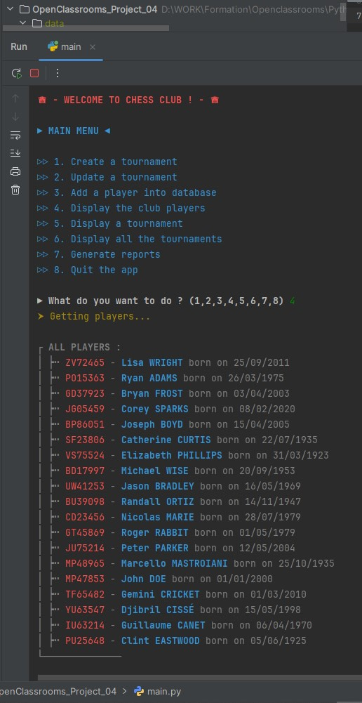
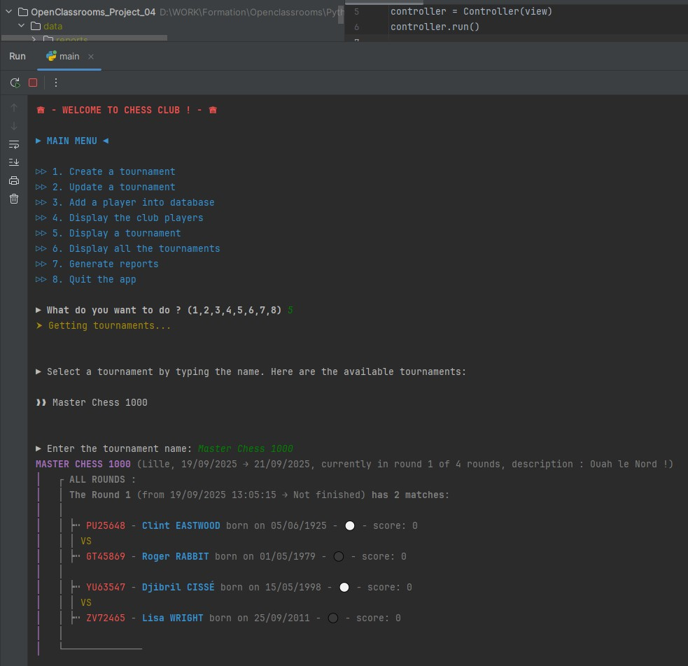

# Chess Tournament Manager (OpenClassrooms Project 04)
**Project 04 : develop a Python application**

# DESCRIPTION

This project was completed as part of the "Python Developer" path at OpenClassrooms.

The goal was to develop a Python offline application capable of:
- Creating and managing a chess tournament and its players for a chess club
- Saving datas in json files
- Displaying / exporting several reports based on tournaments and players

# PROJECT STRUCTURE

# INSTALLATION

## - Clone the repository :
`git clone https://github.com/Tit-Co/OpenClassrooms_Project_04.git`

## - Navigate into the project directory :
`cd OpenClassrooms_Project_04`

## - Create a virtual environment and dependencies :
### Option 1 - with [uv](https://docs.astral.sh/uv/)

`uv` is an environment and dependencies manager.

## - Install environment and dependencies

`uv sync`

### Option 2 - with pip

## - Install the virtual env :

`python -m venv env`

## - Activate the virtual env :
`source env/bin/activate`  
Or  
`env\Scripts\activate` on Windows  

## - Install dependencies 
### Option 1 - with [uv](https://docs.astral.sh/uv/)

`uv pip install -U -r requirements.txt`

### Option 2 - with pip

`pip install -r requirements.txt` 

## USAGE

## Run the main script
`python main.py`

## EXAMPLES

 
 

### You will be prompted with a menu to:
- ▷▷ 1. Create a tournament
- ▷▷ 2. Update a tournament
- ▷▷ 3. Add a player into database
- ▷▷ 4. Display the club players
- ▷▷ 5. Display a tournament
- ▷▷ 6. Display all the tournaments
- ▷▷ 7. Generate reports

# DEPENDENCIES

- colorama, 
- flake8,
- flake8-html,
- faker
- jinja2

# FLAKE8 Reports
**Type the line below to generate reports with [flake8-html](https://pypi.org/project/flake8-html/) tool :**

`flake8 --format=html --htmldir=flake8-report --max-line-length=119 --extend-exclude=env/`

# AUTHOR
**Name**: Nicolas MARIE  
**Track**: Python Developer – OpenClassrooms  
**Project – Develop a Python app : Chess Tournament Manager – September 2025**
